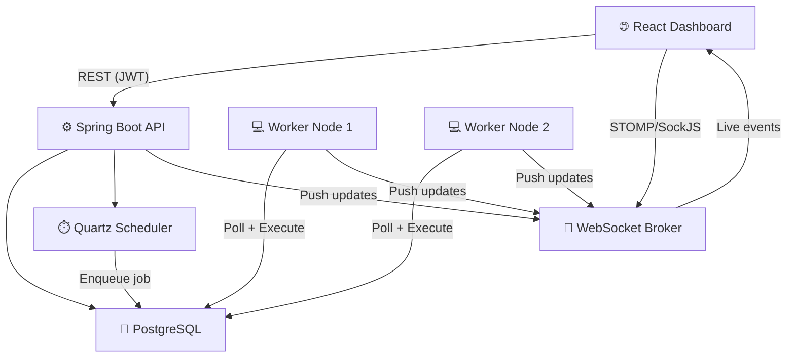
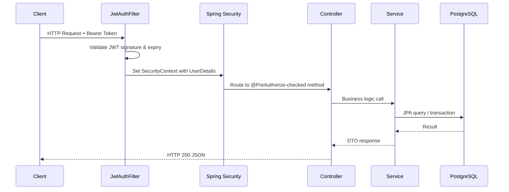
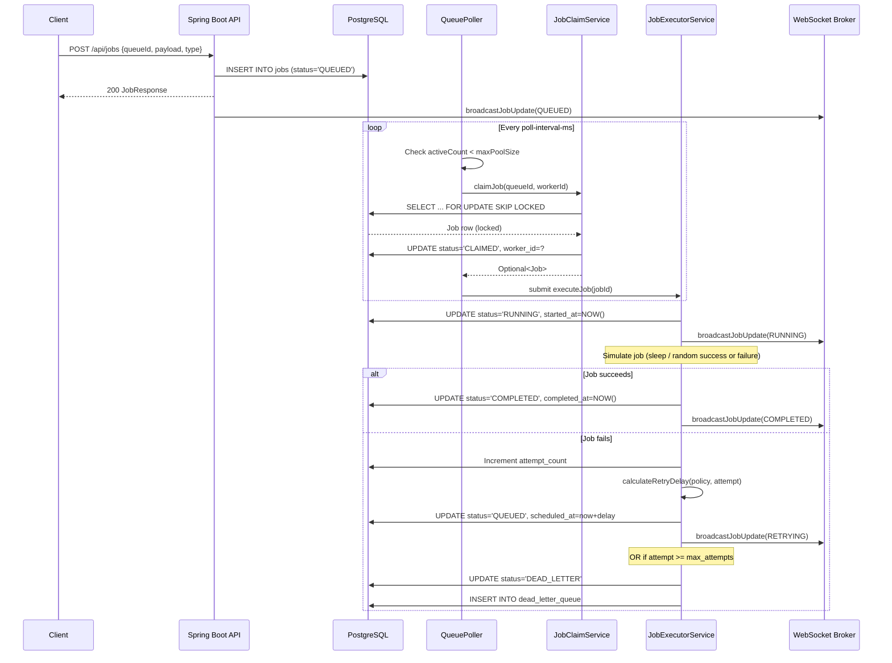
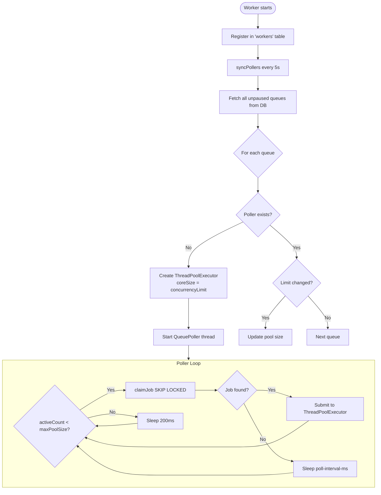
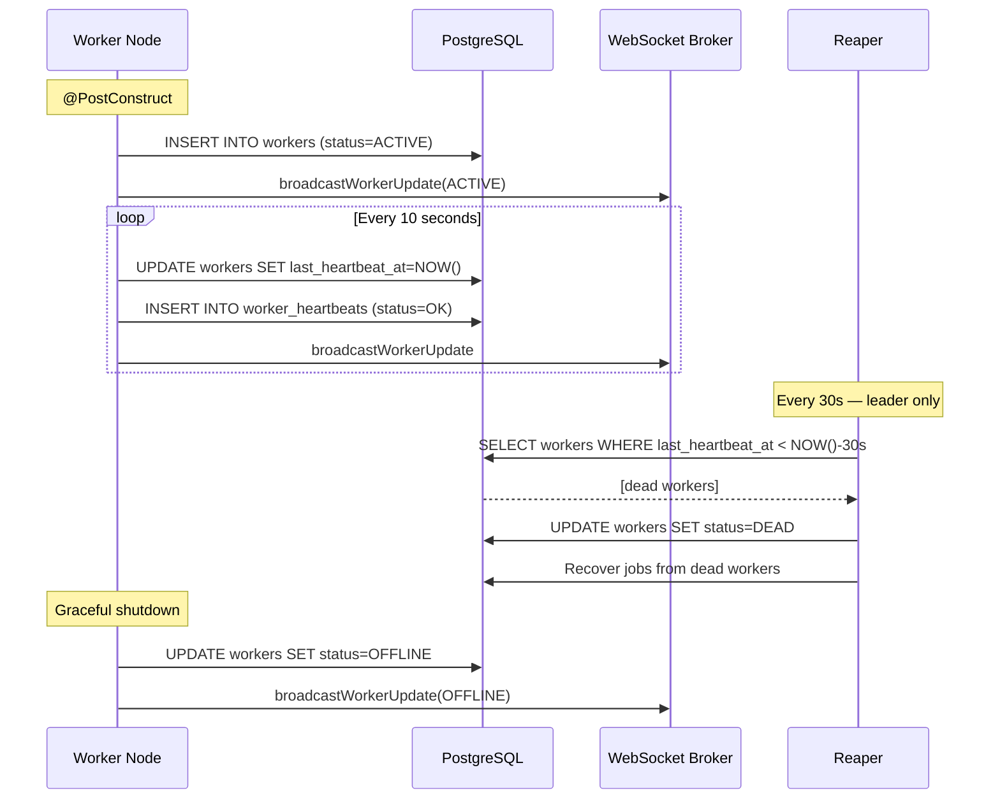
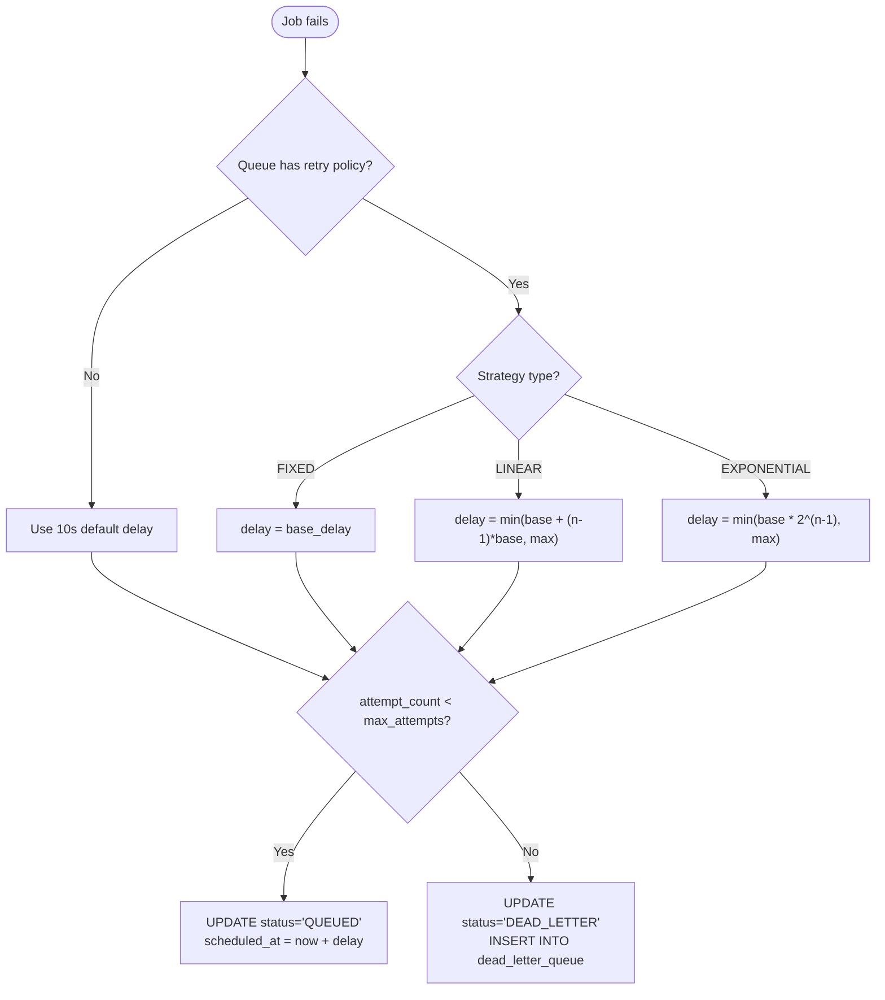
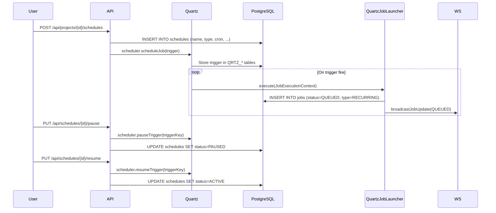

# ARCHITECTURE.md — System Architecture Reference

---

## 1. High-Level System Architecture

```
┌─────────────────────────────────────────────────────────────────────────────┐
│                              JOBSEEK Platform                               │
│                                                                             │
│  ┌──────────────────────────────────────────────────────────────────────┐  │
│  │                         Browser Client                               │  │
│  │              React 18 + Vite SPA (http://localhost:3001)             │  │
│  └─────────────────────────┬────────────────────────────────────────────┘  │
│                             │ REST (JWT)  │ WebSocket (STOMP/SockJS)        │
│  ┌─────────────────────────▼────────────────────────────────────────────┐  │
│  │                    Spring Boot API Server                             │  │
│  │  ┌────────────┐  ┌──────────────┐  ┌────────────┐  ┌─────────────┐ │  │
│  │  │AuthController│ │JobController │  │WorkspacCtrl│  │ScheduleCtrl │ │  │
│  │  └────────────┘  └──────────────┘  └────────────┘  └─────────────┘ │  │
│  │  ┌──────────────────────────────────────────────────────────────┐   │  │
│  │  │             Spring Security (JWT Filter Chain)               │   │  │
│  │  └──────────────────────────────────────────────────────────────┘   │  │
│  │  ┌──────────────────────────────────────────────────────────────┐   │  │
│  │  │         Quartz Scheduler (JDBCJobStore, Clustered)           │   │  │
│  │  └──────────────────────────────────────────────────────────────┘   │  │
│  │  ┌──────────────────────────────────────────────────────────────┐   │  │
│  │  │        WebSocket Broker (STOMP — in-memory broker)           │   │  │
│  │  └──────────────────────────────────────────────────────────────┘   │  │
│  └──────────────────────────┬───────────────────────────────────────────┘  │
│                             │ JDBC / JPA                                    │
│  ┌──────────────────────────▼───────────────────────────────────────────┐  │
│  │                      PostgreSQL 15                                    │  │
│  │   jobs · queues · workers · job_logs · job_executions                │  │
│  │   dead_letter_queue · scheduled_jobs · locks · quartz_tables         │  │
│  └──────────────────────────┬───────────────────────────────────────────┘  │
│                             │ SELECT FOR UPDATE SKIP LOCKED                 │
│       ┌─────────────────────┴──────────────────────┐                       │
│       │                                            │                       │
│  ┌────▼────────────────────────────┐  ┌────────────▼──────────────────┐   │
│  │      Worker Node 1              │  │      Worker Node 2             │   │
│  │  ┌─────────────────────────┐   │  │  ┌─────────────────────────┐  │   │
│  │  │ WorkerHeartbeatService  │   │  │  │ WorkerHeartbeatService  │  │   │
│  │  │ (every 10s)             │   │  │  │ (every 10s)             │  │   │
│  │  └─────────────────────────┘   │  │  └─────────────────────────┘  │   │
│  │  ┌─────────────────────────┐   │  │  ┌─────────────────────────┐  │   │
│  │  │  QueuePollerManager     │   │  │  │  QueuePollerManager     │  │   │
│  │  │  ├── QueuePoller(q1)   │   │  │  │  ├── QueuePoller(q1)   │  │   │
│  │  │  └── QueuePoller(q2)   │   │  │  │  └── QueuePoller(q2)   │  │   │
│  │  └─────────────────────────┘   │  │  └─────────────────────────┘  │   │
│  │  ┌─────────────────────────┐   │  │  ┌─────────────────────────┐  │   │
│  │  │ ReaperService (LEADER)  │   │  │  │ ReaperService (STANDBY) │  │   │
│  │  │ (every 30s)             │   │  │  │ (lock not acquired)     │  │   │
│  │  └─────────────────────────┘   │  │  └─────────────────────────┘  │   │
│  └─────────────────────────────────┘  └────────────────────────────────┘  │
└─────────────────────────────────────────────────────────────────────────────┘
```

---

## 2. Component Interaction



---

## 3. Request Flow (REST API)



---

## 4. Job Execution Flow



---

## 5. Worker Polling Flow



---

## 6. Heartbeat Flow



---

## 7. Retry Flow



---

## 8. Dead Letter Queue Flow

```mermaid
flowchart LR
    MaxAttempts([Max attempts exceeded]) --> SetDL[Set job status = DEAD_LETTER]
    SetDL --> InsertDLQ[INSERT INTO dead_letter_queue\nfinal_error, moved_at]
    InsertDLQ --> Notify[Broadcast via WebSocket]
    Notify --> Dashboard[Dashboard shows in DLQ count]
    Dashboard --> Operator[Operator views job logs]
    Operator --> Retry[Click Retry in UI]
    Retry --> ResetJob["Reset attempt_count=0\nstatus=QUEUED\nscheduled_at=NOW()"]
    ResetJob --> Execution([Normal execution resumes])
```



---

## 9. Scheduler (Quartz) Flow



---

## 10. Database Interaction Summary

| Operation | Implementation | Why |
|-----------|---------------|-----|
| Job claiming | `SELECT FOR UPDATE SKIP LOCKED` | Atomic, no contention |
| Job execution record | `INSERT INTO job_executions` | Audit trail |
| Stats queries | Aggregate `COUNT` with `GROUP BY` status | Dashboard metrics |
| Reaper recovery | Full table scan on `workers.last_heartbeat_at` | Low frequency (30s) |
| Job pagination | `Spring Data Page<Job>` with `Specification` | Flexible filtering |
| Quartz state | `QRTZ_*` tables via JDBCJobStore | Persistent scheduling |
| Distributed locking | `locks` table with `ON CONFLICT DO UPDATE WHERE expires_at < NOW()` | Leader election |
